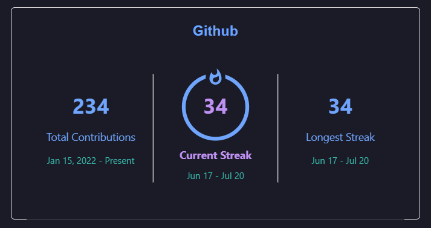
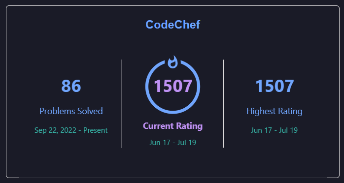

# Pdashboard (Personal Dashboard)

Pdashboard is a productivity dashboard designed to help you keep track of your productivity by displaying your GitHub streak and CodeChef streak. This project is built using Flask and Python for the backend, and it utilizes web scraping to fetch data from GitHub and CodeChef. The dashboard interface is created using HTML and JavaScript.

You can access the live version of the Pdashboard at [https://nisar-dashboard.onrender.com/](https://nisar-dashboard.onrender.com/)

## Folder Structure

- `templates/`: This folder consists of the HTML files for the dashboard interface - `index.html`, `codechef.html`, and `github.html`.
- `app.py`: This Python file contains the Flask application and handles the web scraping for GitHub and CodeChef data.
- `README.md`: The file you are currently reading, providing an overview of the project.
- `requirements.txt`: A list of Python dependencies required to run the application.

## Usage

To use Pdashboard locally, follow the instructions below:

1. Clone or download the repository to your local machine.
2. Install the required Python dependencies using `pip install -r requirements.txt`.
3. Run the Flask app using `python app.py`. The dashboard will be accessible at `http://127.0.0.1:5000/` in your web browser.
4. The dashboard will display two widgets: one for GitHub and one for CodeChef.
5. The GitHub widget shows your current streak, fetched using web scraping from your GitHub profile.
6. The CodeChef widget also displays your streak, fetched using web scraping from your CodeChef profile.

Please note that for the web scraping to work correctly, ensure you have a stable internet connection.

## Web Scraping

The Pdashboard utilizes web scraping techniques to fetch data from GitHub and CodeChef. Here are the code snippets responsible for scraping the data:

### GitHub Web Scraping

def gitupdate(totalcontrib, currentstreak, streakrange, longeststreak, longestrange):
    # Your GitHub web scraping code goes here
    # ...

# Example usage:
gitupdate(totalcontrib=0, currentstreak=0, streakrange=0, longeststreak=0, longestrange=0)  # Provide actual values here

### CodeChef Web Scraping

def codechef():
    # Your CodeChef web scraping code goes here
    # ...

# Example usage:
codechef()

## Future Plans

- Enhance the dashboard with more customization options and a user-friendly interface.
- Add support for additional productivity platforms and display their streaks.
- Implement user authentication to enable users to personalize their dashboard.
- Optimize the web scraping process for faster and more efficient data retrieval.

Feel free to customize and enhance the project further as per your requirements. Contributions and suggestions are welcome!

## Screenshots

## License

This project is licensed under the [MIT License](LICENSE).

Remember to replace `screenshot_github.png` and `screenshot_codechef.png` with actual screenshots showcasing your dashboard in action.

With this README, users will have a comprehensive understanding of your project, how to set it up, the web scraping functionalities used, and your future plans for further development.